
<h1 align="center">基于java的药物销售系统</h1>

## 简介
药物销售系统：角色分为管理员、用户；包含药品信息展示、用户注册登录、订单管理、购物车管理、药品搜索、数据统计分析功能，注重用户体验。    --计算机毕业设计源码；毕设源码；java毕业设计源码

## 联系方式

<h3 align="center">获取完整代码与数据库文件 + 微信：deepguan QQ: 86050149 QQ群: 783742310</h3>

<h3 align="center">可帮忙远程部署 包运行成功！提供远程部署、修改代码、设计文档指导、代码讲解等服务！</h3>

## 功能介绍（完整见运行截图）
管理员：基本功能包括登录、注册和退出。药物信息管理模块允许添加、编辑和删除药品信息，包括上传图片和填写规格、厂家、库存、积分等详细信息。订单管理模块提供订单统计、查看、发货、删除和多种销售统计功能。系统管理与用户管理模块便于管理系统用户、设置药品类别、查看用户反馈和进行系统配置等操作，确保系统的有效运行和用户需求的满足。

用户：基本功能包括登录、注册和退出。用户可以在网站首页通过导航栏进入不同模块，查看药品详情并管理购物车。订单管理模块支持查看订单信息、支付、取消或确认收货等功能。用户个人中心提供个人信息查看与修改、订单查询、收货地址管理和收藏夹功能。用户可以浏览药品信息，使用搜索和筛选功能快速找到所需药品，并通过界面进行高效便捷的购买操作。

## 运行截图

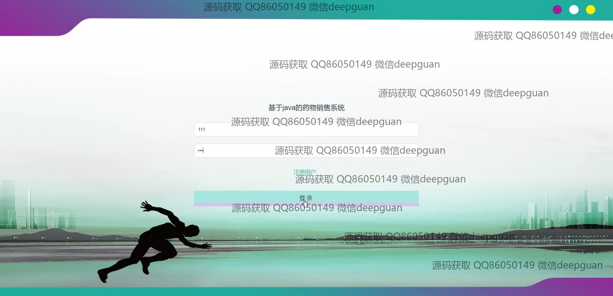
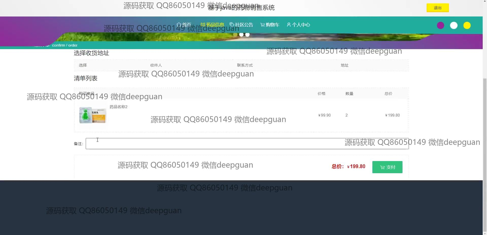
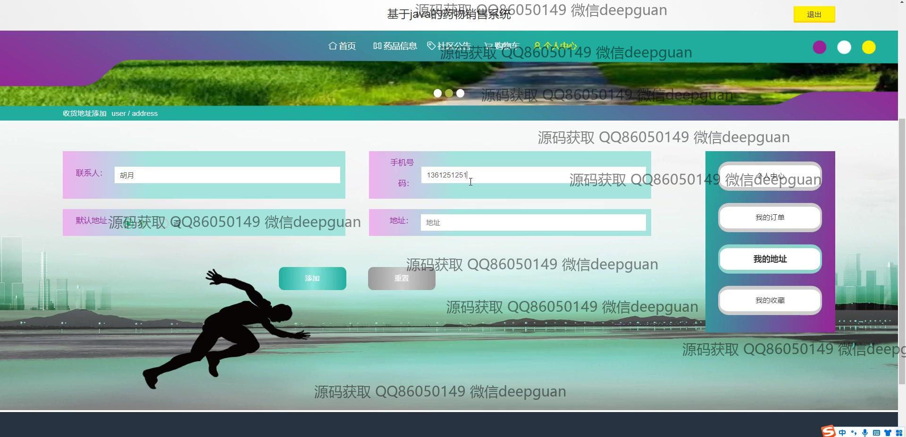
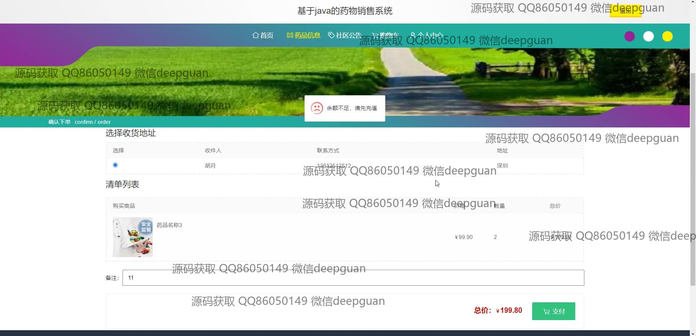
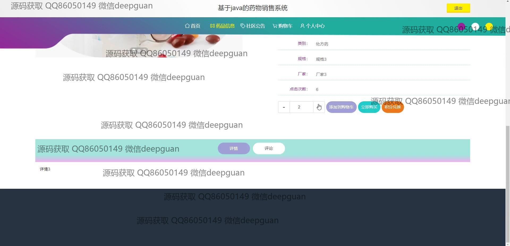
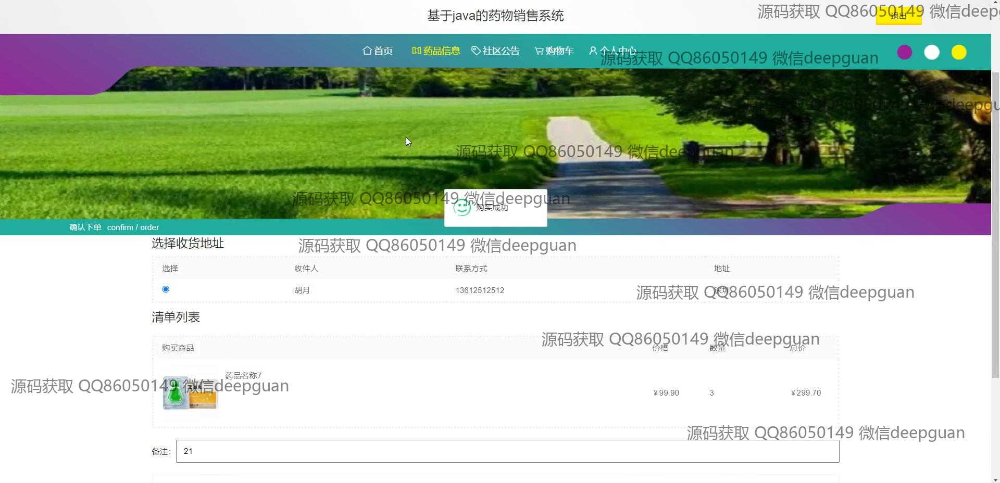
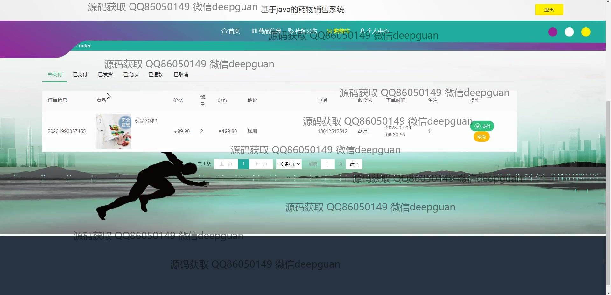
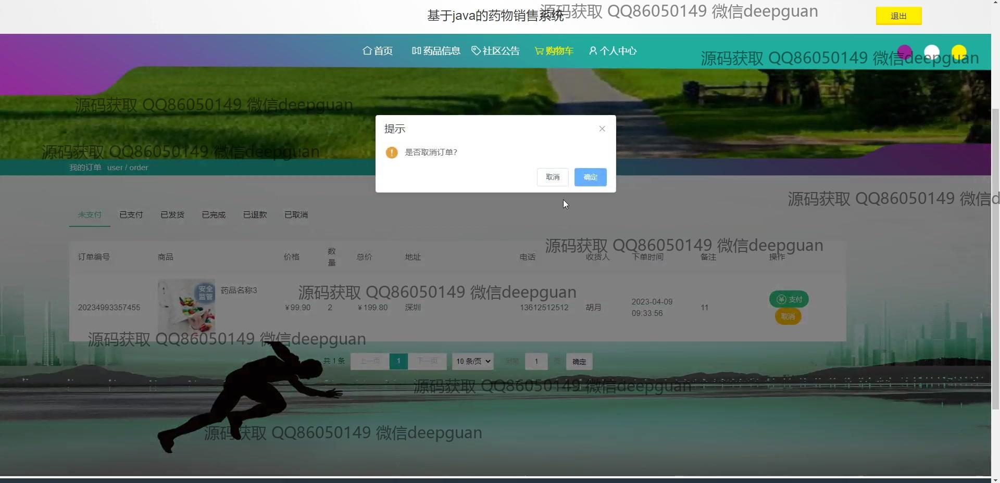
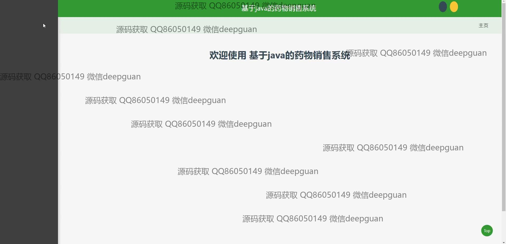

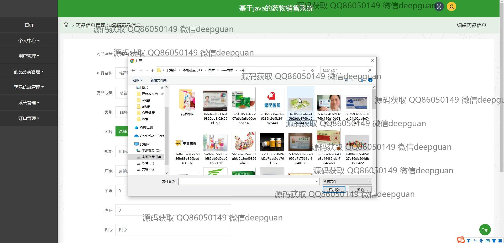
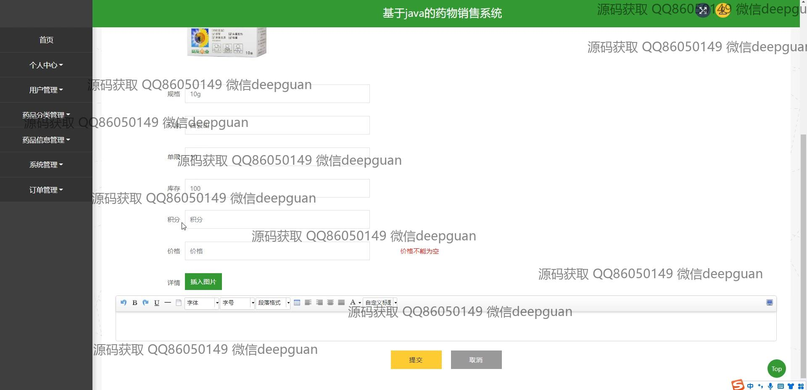
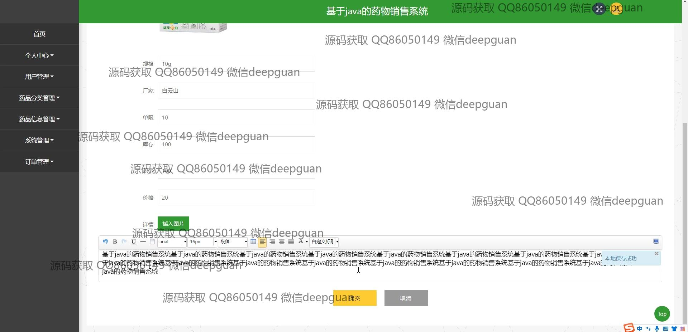
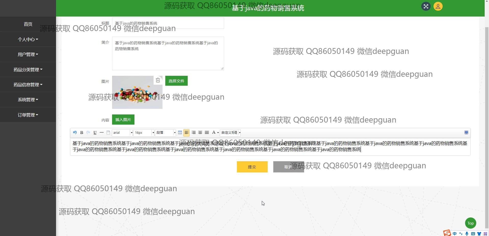
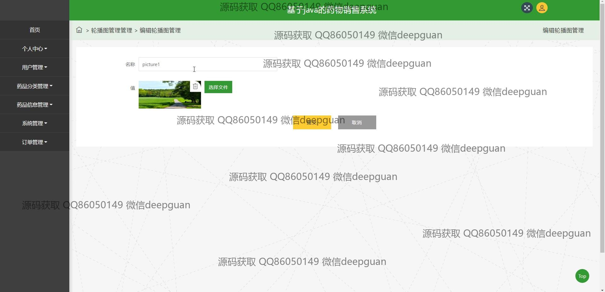
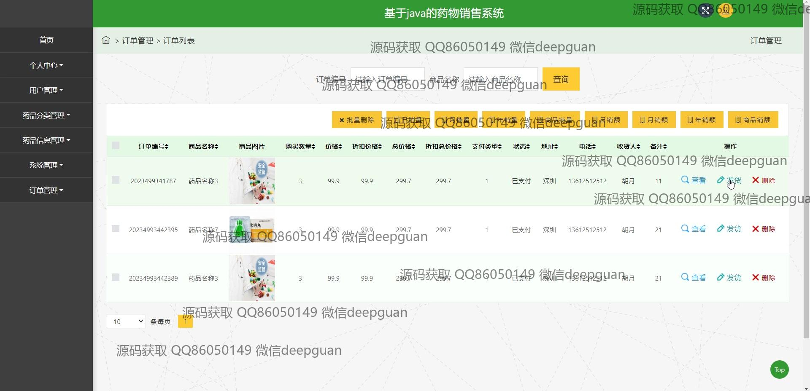
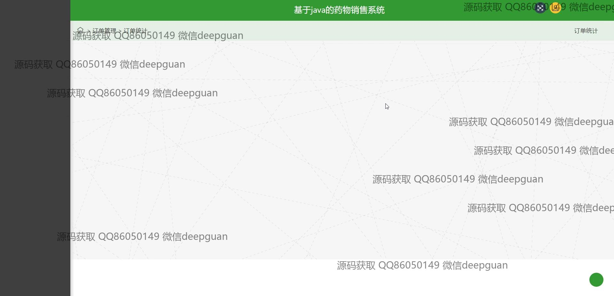
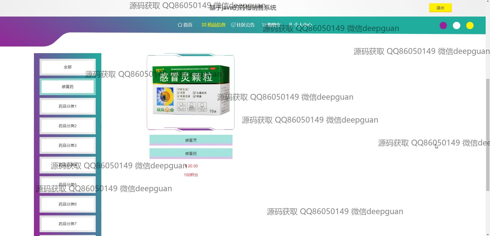
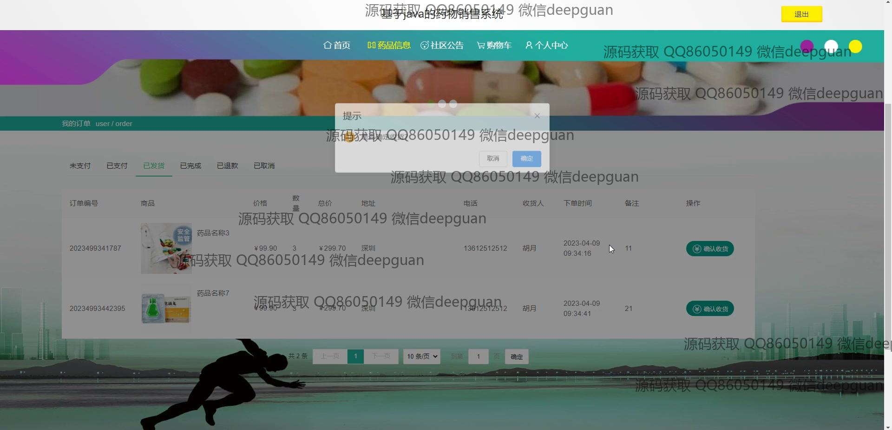
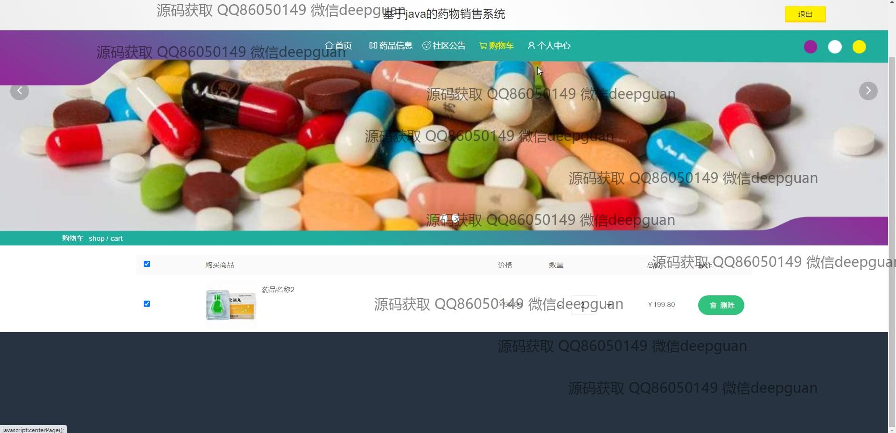
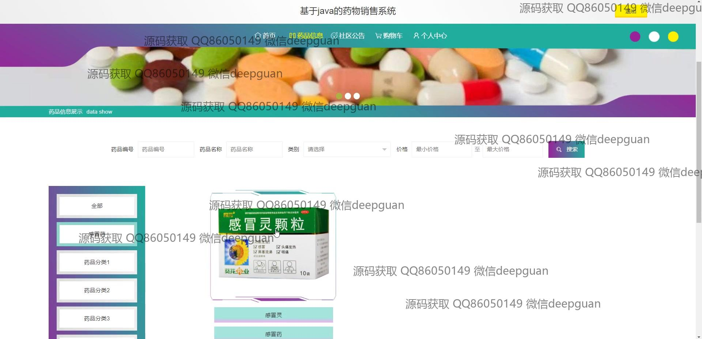
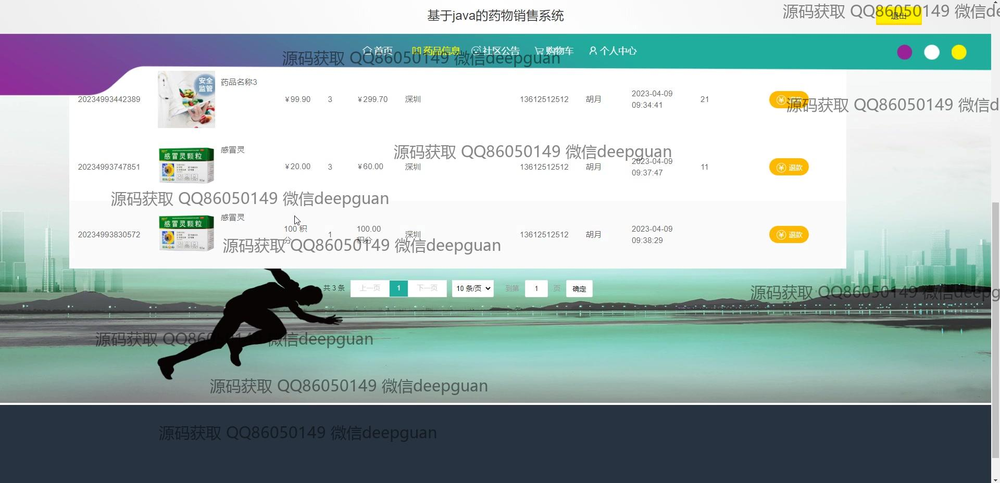

本代码来源于网络,仅供学习参考使用!

